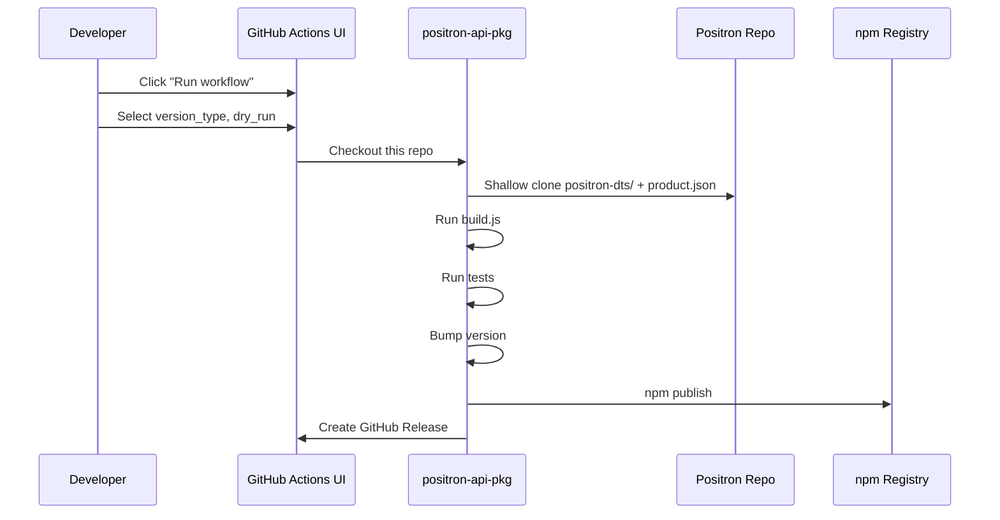

# GitHub Actions Release Workflow for @posit-dev/positron

## Phased Rollout Strategy

| Phase | Scope | Risk | When |

|-------|-------|------|------|

| **Phase 1** | Manual trigger only (`workflow_dispatch`) | Low | Now |

| **Phase 2** | Add Positron dispatch trigger | Medium | After Phase 1 is stable |

This approach lets you iterate on the CI workflow without touching the Positron repo until you're confident it works.

## Phase 1: Manual Push-Button Release (Implement Now)

### Architecture



### Workflow: `.github/workflows/release.yml`

**Trigger:** `workflow_dispatch` only (manual via GitHub Actions UI)

**Inputs:**

| Input | Type | Default | Description |

|-------|------|---------|-------------|

| `version_type` | choice | `patch` | Version bump type (patch/minor/major) |

| `positron_ref` | string | `main` | Positron branch/tag to build against |

| `dry_run` | boolean | `false` | Test run - builds but skips publish |

**Steps:**

1. Checkout this repository
2. Shallow clone Positron repo (depth=1, only needed files)
3. Set up Node.js 20
4. Install dependencies
5. Run `npm run build` 
6. Run `npm run test:coverage`
7. Bump version via `npm version $type --no-git-tag-version`
8. Update README compatibility table
9. Commit changes with bot identity
10. Publish to npm (skip if dry_run)
11. Create git tag and GitHub Release

**Key Implementation Details:**

- Uses shallow clone (`--depth 1`) instead of sparse checkout for simplicity and reliability
- Clones Positron to `../positron` relative to workspace (matches `build.js` expectations)
- Reads Positron version from `product.json` automatically
- Configures git with `github-actions[bot]` identity
- Uses `GITHUB_TOKEN` (automatic) for commits/releases
- Uses `NPM_TOKEN` (secret) for npm publish

### NPM Token Setup (Required)

1. Go to [npmjs.com](https://www.npmjs.com) and sign in
2. Click profile icon -> Access Tokens
3. Generate New Token -> Classic Token -> **Automation**
4. Copy the token
5. In GitHub: Repository Settings -> Secrets and variables -> Actions
6. Click "New repository secret"
7. Name: `NPM_TOKEN`, Value: (paste token)

### How to Trigger a Release

1. Go to repository on GitHub
2. Click **Actions** tab
3. Select **Release** workflow in sidebar
4. Click **Run workflow** dropdown
5. Select options:

   - `version_type`: patch (default), minor, or major
   - `positron_ref`: main (or specific tag like `2025.07.0`)
   - `dry_run`: check to test without publishing

6. Click **Run workflow**

---

## Phase 2: Add Positron Dispatch Trigger (Future)

Once Phase 1 is stable, add automatic triggering from Positron releases.

### Changes to This Repo's Workflow

Add `repository_dispatch` to the existing `on:` block (3 lines):

```yaml
on:
  repository_dispatch:
    types: [positron-release]
  workflow_dispatch:
    # ... existing inputs unchanged
```

Add logic to extract version from dispatch payload:

```yaml
env:
  POSITRON_VERSION: ${{ github.event.client_payload.positron_version || '' }}
```

### Changes to Positron Repo

Add this step to Positron's release workflow:

```yaml
- name: Trigger positron-api-pkg release
  uses: peter-evans/repository-dispatch@v3
  with:
    token: ${{ secrets.POSITRON_API_PKG_PAT }}
    repository: posit-dev/positron-api-pkg
    event-type: positron-release
    client-payload: '{"positron_version": "${{ env.POSITRON_VERSION }}", "ref": "${{ github.ref }}"}'
```

**Required Secret in Positron repo:** `POSITRON_API_PKG_PAT` - a Personal Access Token with `repo` scope for cross-repo dispatch.

---

## Security Considerations

- `NPM_TOKEN`: Required secret for npm publish (Automation token type)
- `GITHUB_TOKEN`: Automatic, used for commits and releases (scoped to this repo)
- Phase 2 only: PAT with `repo` scope in Positron repo for cross-repo dispatch